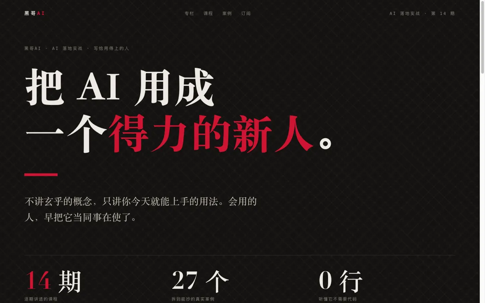

# HeiGe-UI

<div align="center">


**界面锻造系统 | Forge, don't generate**

界面不是生成的，是锻造的。

[这是什么](#这是什么-what-is-this) • [方法论](#核心方法论-五道锻造工序) • [样例画廊](#样例画廊-gallery) • [快速开始](#快速开始-quick-start) • [使用指南](#使用指南-usage-guide)

<br>

<a href="https://heigeai.github.io/HeiGe-UI/examples/darktech-console.html"></a>

</div>

---

## 这是什么 What is this

让 AI 做出**有气场、有记忆点、一眼不像 AI 做的**前端界面。

你肯定见过那种界面：居中卡片、紫蓝渐变、圆角阴影，工工整整，挑不出错，但你**三秒就忘**。因为 AI 只是把组件从货架上扯下来，平铺在画布上，能用，仅此而已。

HeiGe-UI 不这么干。它把一个界面当成一段**有节奏的叙事**来导演：有开场，有张弛，有主角，有一个让你记住的瞬间。做完一眼能认出，这是**人锻造的**，不是机器生成的。

它不是又一个组件模板库，而是一套从真实商业项目里磨出来的方法论：

- ✅ **五道锻造工序**，每件作品都要过一遍
- ✅ **八种极端气质**，每种都给到能直接上手的打法
- ✅ **反 AI 体检清单**，把那股 AI 味摁死在交付前
- ✅ 动手前先定调，出货前过体检
- ✅ **十二个跨气质样例**，同一套方法论，做出完全不同的东西
- ✅ 零依赖单文件，到处都能用

**适用场景**：产品官网、落地页、Dashboard、组件库、营销页、App 界面、Web 应用、作品集、活动页。

**支持平台**：Claude Code、Cursor、Windsurf、Cline、Aider、OpenClaw、Hermes、ChatGPT、Claude.ai 等。

> 别人做的是网页，你做的是带签名的作品。一眼能认出，这是锻造的，不是生成的。

---

## 为什么需要它 Why this matters

| 普通 AI 给你的界面 | HeiGe-UI 锻造的界面 |
|---|---|
| 紫蓝渐变 + 居中卡片 + 圆角阴影，老三样，能用，但你三秒就忘 | 首屏 3 秒立住气质，看一眼就记住 |
| 组件一字排开，一个调子干到底 | 像电影一样有起伏：开场、铺垫、高潮、收尾 |
| 什么都想突出，结果一个都没突出 | 一屏只捧一个主角，其余全往后退 |
| 换个模板就能把你平替，毫无辨识度 | 每页都有一个别人做不出来的签名瞬间 |
| 一眼被看穿是 AI 糊弄的 | 出货前过一遍反 AI 体检，糊弄不过关 |

---

## 核心方法论 五道锻造工序

写代码之前先想清楚：用户从打开页面到离开，你想让他经历一段什么样的体验？平铺思维问的是「这页放哪些模块」，导演思维问的是「节奏是什么、高潮在哪、走的时候记住了什么」。

### ⚒️ 01 开场定调 Cold Open
首屏 3 秒决定一切。它不是用来摆标题和按钮的，是用来立人设、定气质的。

### 🌊 02 节奏曲线 Pacing Curve
页面像电影一样有张弛：冲击 → 呼吸 → 推进 → 高潮 → 收束。不要均匀平铺、一个调子到底。

### 🎯 03 一屏一主角 One Protagonist
每一屏只能有一个视觉主角，其余全是配角。什么都想突出 = 什么都不突出。

### ✦ 04 签名时刻 Signature Moment
每个作品至少要有一个别人不会做、也不太敢做的记忆点。这是作者签名，一个就够，但必须有。

### 🔍 05 反 AI 体检 Anti-Slop Check
出货前强制过一遍体检：紫蓝渐变？居中卡片三件套？默认字体裸奔？命中任何一条都要回去重做。这一步不是可选的，是交付门槛。

完整方法论与使用流程见 [`SKILL.md`](SKILL.md)。

---

## 八种气质方向

定调时从中选一个**极端**方向，或在此基础上自创。原则：宁可走极端走出记忆点，也不要选「现代简约」这种安全的废话。

凶悍/工业 · 优雅/高定 · 克制/极简 · 张扬/极繁 · 复古/未来 · 有机/自然 · 玩味/玩具 · AI原生/暗色科技

每种气质的色彩、字体、排版、动效、签名时刻打法见 [`references/aesthetic-directions.md`](references/aesthetic-directions.md)。

---

## 样例画廊 Gallery

同一套方法论，十二种气质，做出十二个完全不同的东西。每个都是现场锻造的零依赖单文件。**点开任意预览图即可看在线 Demo。**

### 基础气质

| 预览 | 气质 | 主题 |
|:--:|:--|:--|
| <a href="https://heigeai.github.io/HeiGe-UI/examples/forge-landing.html"></a> | **凶悍 / 工业** | HeiGe-UI 自己的落地页 |
| <a href="https://heigeai.github.io/HeiGe-UI/examples/editorial-journal.html"></a> | **高定 / 杂志** | 独立文化季刊《潮间带》 |
| <a href="https://heigeai.github.io/HeiGe-UI/examples/editorial-noir.html"></a> | **高定 / 杂志（暗色）** | 黑哥AI 内容品牌落地页 |
| <a href="https://heigeai.github.io/HeiGe-UI/examples/neon-nightshift.html"></a> | **赛博霓虹** | AI 编程夜班工具 |
| <a href="https://heigeai.github.io/HeiGe-UI/examples/playful-boing.html"></a> | **玩具** | 习惯养成 App |
| <a href="https://heigeai.github.io/HeiGe-UI/examples/swiss-ledger.html"></a> | **瑞士极简** | 现金流分析产品 |
| <a href="https://heigeai.github.io/HeiGe-UI/examples/darktech-console.html"></a> | **AI 原生 / 暗色科技** | Agent 编排控制台 HELM |

### 年轻 / 潮流向

| 预览 | 气质 | 主题 |
|:--:|:--|:--|
| <a href="https://heigeai.github.io/HeiGe-UI/examples/y2k-gaga.html"></a> | **Y2K 千禧辣妹** | Gen-Z 拍照社交 App |
| <a href="https://heigeai.github.io/HeiGe-UI/examples/brat-noisepark.html"></a> | **brat 酸性极简** | 独立音乐节 |
| <a href="https://heigeai.github.io/HeiGe-UI/examples/streetwear-drop.html"></a> | **街头潮牌** | 潮牌限量发售 |
| <a href="https://heigeai.github.io/HeiGe-UI/examples/acg-stellar.html"></a> | **二次元 ACG** | 音游手游 |
| <a href="https://heigeai.github.io/HeiGe-UI/examples/wrapped-soundwave.html"></a> | **Wrapped 撞色** | 音乐年度报告 |

也可以本地预览：
```bash
git clone https://github.com/HeiGeAi/HeiGe-UI.git
cd HeiGe-UI && python3 -m http.server 8753
# 浏览器打开 http://localhost:8753/examples/
```

---

## 快速开始 Quick Start

### 方法 1：支持 Skill 系统的平台（推荐）

适用于 Claude Code、Cursor、Windsurf、Cline：

```bash
git clone https://github.com/HeiGeAi/HeiGe-UI.git
cp -r HeiGe-UI ~/.claude/skills/
```

然后直接说：

```
用 HeiGe-UI 做个落地页
设计一个有气场的产品官网
帮我把这个界面做得一眼不像 AI 做的
```

### 方法 2：作为 System Prompt 使用

适用于 ChatGPT、Claude.ai、Aider、OpenClaw、Hermes：

1. 下载本仓库的 `SKILL.md`
2. 将内容粘贴到 AI 助手的 system prompt 或自定义指令中
3. 直接对话使用，无需特殊命令

---

## 使用指南 Usage Guide

HeiGe-UI 会带你走完整个锻造流程：

1. **定调**：先和你确认这个界面给谁、解决什么问题、什么气质方向（七种里挑一个极端的）。
2. **编排节奏**：排一遍页面的节奏曲线，首屏怎么开场、高潮放哪、怎么收束。
3. **锁定主角与签名时刻**：逐屏确认视觉主角，全局确认这一页的记忆点是什么。
4. **写生产级代码**：真实可运行的代码，字体做性格，间距对比有大胆决策。
5. **反 AI 体检**：出货前过一遍体检清单，命中 AI slop 特征的全部干掉。

### 场景示例

**做一个产品落地页**
```
用 HeiGe-UI 给我做一个 AI 笔记工具的落地页，气质要凶悍一点
```

**美化现有界面**
```
这个 Dashboard 太像 AI 做的了，用 HeiGe-UI 帮我重新锻造一版
```

**指定气质方向**
```
用 HeiGe-UI 做个活动页，走 Y2K 千禧风
```

---

## 平台兼容性 Platform Compatibility

HeiGe-UI 本质是一套让 AI 写好前端代码的方法论，不绑定任何工具的文件系统或插件能力。**只要这个 AI 能写代码，它就能用 HeiGe-UI。** 平台之间的差别只有两点：怎么装，以及输出怎么拿到。

| 平台 | 能不能用 | 安装方式 | 输出怎么拿 |
|------|:---:|---------|-----------|
| **Claude Code / Cursor / Windsurf / Cline** | ✅ | 放进 skill 目录 | 自动写成文件 |
| **Aider / OpenClaw / Hermes** | ✅ | 贴进 system prompt | 自动写成文件 |
| **ChatGPT / Claude.ai / 其他 AI** | ✅ | 把 SKILL.md 贴成自定义指令 | 复制代码块，自己存成 .html |

没有**不兼容**的平台，只有**装法不同**的平台。输出统一是标准 HTML / CSS / JS（或 React），不依赖任何运行时。

> 提示：深度打法都在 `references/` 里。支持 skill 的平台会按需自动读取；纯贴 prompt 的平台，把 `SKILL.md` 和 `references/` 一起贴上，方法论最完整。

---

## 项目结构 Project Structure

```
HeiGe-UI/
├── SKILL.md                      # Skill 主文件：方法论 + 使用流程
├── references/                   # 设计资产
│   ├── aesthetic-directions.md   # 八种气质方向库（每种给到具体打法）
│   ├── anti-slop-checklist.md    # 反 AI 体检清单（交付门槛）
│   ├── production-checklist.md   # 生产铁律（字体兜底 / 零孤字 / 性能）
│   └── pacing-templates.md       # 节奏曲线模板（各类页面的张弛排布）
├── examples/                     # 同一套方法论 × 十二种气质的样例画廊
│   ├── forge-landing.html
│   ├── editorial-journal.html
│   ├── editorial-noir.html
│   ├── neon-nightshift.html
│   ├── darktech-console.html
│   ├── playful-boing.html
│   ├── swiss-ledger.html
│   ├── y2k-gaga.html
│   ├── brat-noisepark.html
│   ├── streetwear-drop.html
│   ├── acg-stellar.html
│   └── wrapped-soundwave.html
├── assets/
│   └── previews/                 # README 用的样例预览图（WebP）
├── LICENSE
├── CHANGELOG.md
└── README.md
```

---

## 版本历史 Version History

完整记录见 [CHANGELOG.md](CHANGELOG.md)。

### v1.2.0 (2026-07-04)
- 🖤 高定/杂志方向补一套**暗色配方（玄墨 × 绛红衬线）**写进 `references/aesthetic-directions.md`：玄黑底 #141210 + 奶白字 #EDEAE3 + 绛红 #CE1432，衬线大标题 + 斜纹底纹 + 绛红大序号；讲清和亮色纸墨版、和方向 8 暗色科技（无衬线冷工程感）的分野
- 🖼️ 新增样例 `editorial-noir`（黑哥AI 内容品牌落地页），签名时刻是占屏巨号衬线宣言「能跑了是起点，交得出去才是本事」，源自黑哥课程分享 deck 的视觉体系
- 📐 守生产铁律：中文衬线系统兜底（Google Fonts 挂了退思源宋体/宋体不崩）、大标题零孤字、斜纹装饰纯 CSS 不碰 backdrop-filter、动画只动 transform/opacity 且尊重 reduced-motion
- 📖 README / SKILL 同步：样例画廊 11 → 12

### v1.1.0 (2026-06-24)
- ✨ 新增第 8 种气质方向「AI 原生 / 暗色科技（Dark Tech）」：深色基底 + 克制单色辉光 + 网格光晕，对标 Linear / Vercel / Runway 那一挂当代 AI 产品质感，含深空电青 / Aurora 极光 / 碳黑电绿 / 午夜蓝四套配方，并讲清和复古赛博（方向 5）的区别
- 🖼️ 新增碳黑电绿旗舰样例 `darktech-console`（虚构 Agent 编排控制台 HELM），签名时刻是「8 个 Agent 同时干活的实时面板」
- 🔒 守生产铁律：辉光只用 box-shadow / radial-gradient，不碰 backdrop-filter

### v1.0.2 (2026-05-29)
- ✏️ 项目更名为 HeiGe-UI；新增生产交付铁律 `references/production-checklist.md`
- 🖼️ 按修复后的样例重新生成全部预览图

### v1.0.1 (2026-05-28)
- 🔤 全部样例中文字体补系统兜底，Google Fonts 失败也不崩；acg 把日文字体换成简体中文字体
- ⚡ 性能加固：移除 backdrop-filter、动画化阴影、常驻 rAF，无限动画收敛
- 📐 修复大标题折行孤字

### v1.0.0 (2026-05-28)
- 🎉 首次发布
- ⚒️ 原创方法论「导演一段叙事」，五道锻造工序：开场定调 / 节奏曲线 / 一屏一主角 / 签名时刻 / 反 AI 体检
- 📐 五步使用流程：定调 → 编排节奏 → 锁定主角与签名时刻 → 写生产级代码 → 反 AI 体检
- 🎨 七种气质方向库 + 反 AI 体检清单 + 节奏曲线模板
- 🖼️ 十个跨气质样例，覆盖基础气质与年轻潮流向，全部零依赖单文件

---

## 许可证 License

MIT License，详见 [LICENSE](LICENSE) 文件。

---

## 联系方式 Contact

- **Author**: Blake 黑哥
- **WeChat**: 488137
- **GitHub**: [@HeiGeAi](https://github.com/HeiGeAi)

---

<div align="center">

**如果这个项目对你有帮助，请给个 ⭐️ Star 支持一下！**

Made by Blake 黑哥
锻造，而不是生成。

</div>

## 更多开源工具

本项目属于黑哥 AI 的开源武器库。全部开源项目的清单、用途和协议,见 [heigeai.com/opensource](https://www.heigeai.com/opensource/)。
